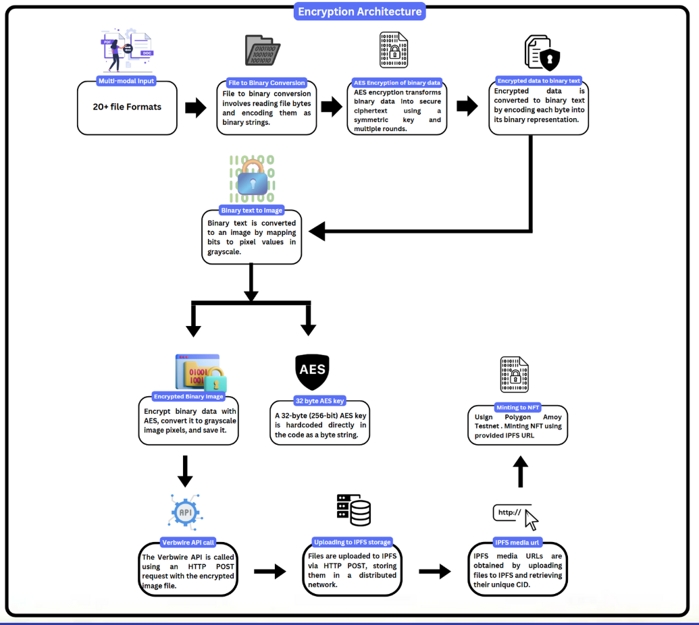
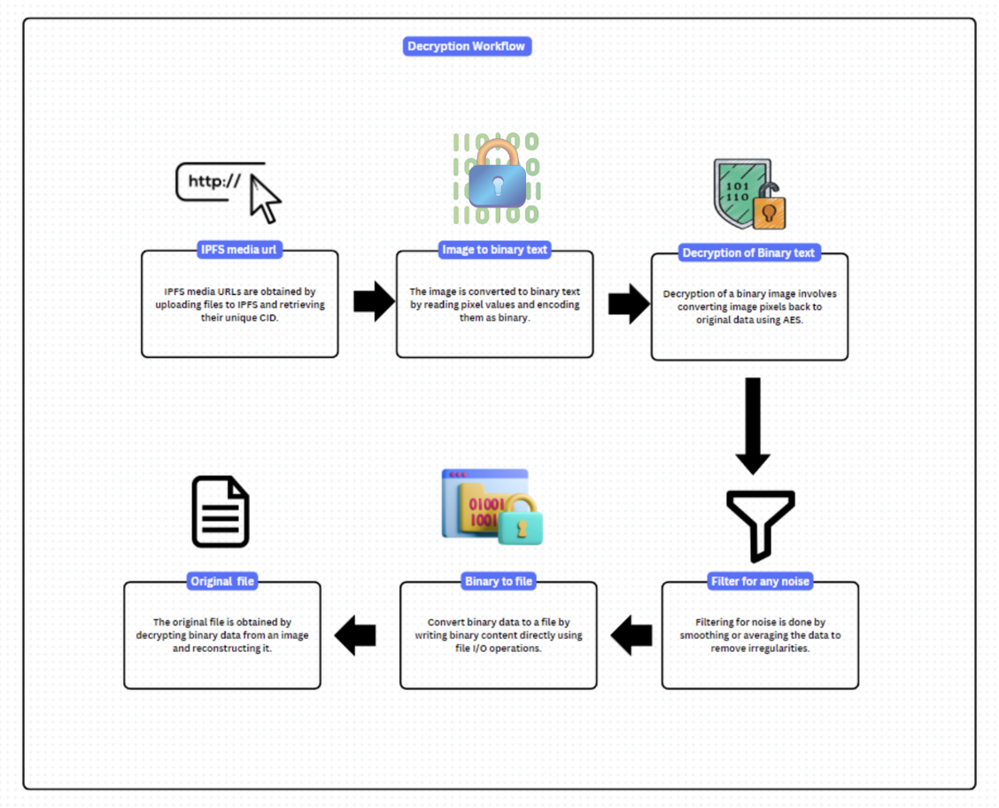

<h1 align="center">🔒 BitLocks</h1>

  Empower your data security with advanced encryption, decentralized storage, and NFT ownership.

<h2 align="center">🚀 Overview</h2>

  <b>BitLocks</b> is a robust encryption and decryption platform designed to securely store and manage valuable information. It combines advanced cryptographic techniques with a user-friendly interface to enhance data privacy while integrating optional NFT ownership for digital rights management.

<h2 align="center">🎯 Goals</h2>
<ul>
  <li>Provide a simple, reliable, and secure solution for managing sensitive data.</li>
  <li>Leverage modern encryption, decentralized storage, and NFT ownership techniques for comprehensive security and ownership management.</li>
</ul>

<h2 align="center">🌟 Key Features</h2>
<ul>
  <li><b>File Encryption & Decryption:</b> Protect sensitive files with strong encryption mechanisms.</li>
  <li><b>IPFS Integration:</b> Securely store encrypted files on a decentralized network using a unique Content Identifier (CID).</li>
  <li><b>Key Visualization:</b> Generate and store encryption keys as images for added security and convenience.</li>
  <li><b>NFT for Ownership:</b> Mint NFTs representing ownership or metadata of encrypted files to enable digital rights management.</li>
  <li><b>User Management:</b> Login and signup functionality with secure storage of user credentials in a MySQL database.</li>
  <li><b>Custom File Preview:</b> View encrypted files, including key images, with options to edit or delete them.</li>
</ul>

<h2 align="center">🔧 How It Works</h2>
<ol>
  <li><b>Encrypt Files:</b> Upload files, generate encryption keys, and store them securely.</li>
  <li><b>Store on IPFS:</b> Files are uploaded to IPFS, ensuring integrity and decentralization.</li>
  <li><b>Key Management:</b> Encryption keys are converted into images and stored alongside file data.</li>
  <li><b>NFT Ownership:</b> Optionally mint NFTs linked to encrypted file metadata for ownership traceability.</li>
  <li><b>Decryption:</b> Retrieve files using the stored keys for seamless decryption.</li>
</ol>

<h2 align="center">🛠 Architectures</h2>

<h3 align="center">Encryption Architecture</h3>

  

<h3 align="center">Decryption Architecture</h3>

  

<h2 align="center">📋 Prior Installations</h2>

  To get started with BitLocks, ensure you have the following installations ready:

<ul>
  <li>Install <b>Node.js</b>: <a href="https://nodejs.org/">Download and Install</a></li>
  <li>Install required Python libraries:
    <ul>
      <li><code>pip install web3</code></li>
      <li><code>pip install py-solc-x</code></li>
    </ul>
  </li>
  <li>Install OpenZeppelin library:
    <ul>
      <li><code>npm install @openzeppelin/contracts</code></li>
    </ul>
  </li>
</ul>

<h2 align="center">📂 Technology Stack</h2>
<table align="center">
  <tr>
    <th>Backend</th>
    <td>Python (Streamlit), MySQL</td>
  </tr>
  <tr>
    <th>Frontend</th>
    <td>Streamlit with custom CSS for enhanced UI/UX</td>
  </tr>
  <tr>
    <th>Blockchain</th>
    <td>IPFS for decentralized storage, NFT support</td>
  </tr>
</table>
